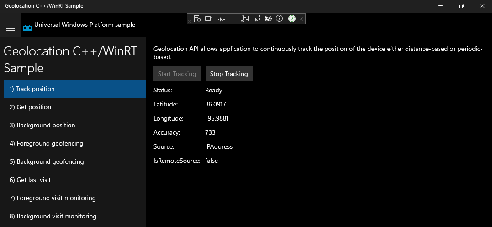
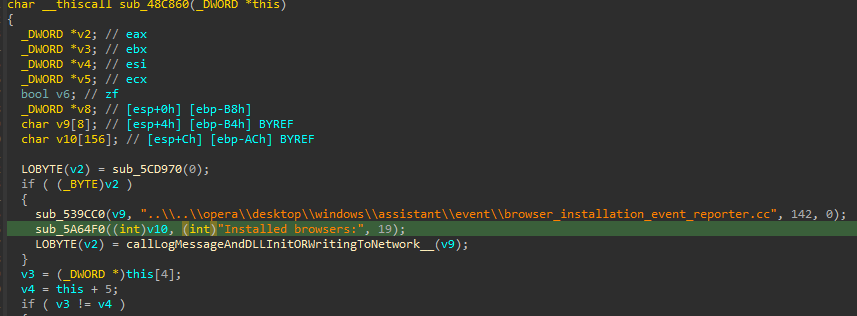
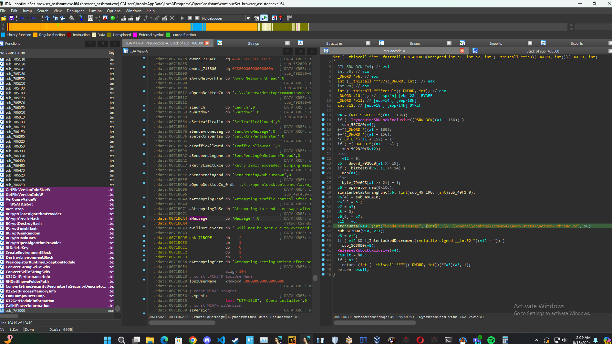
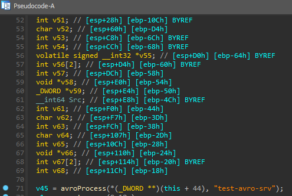
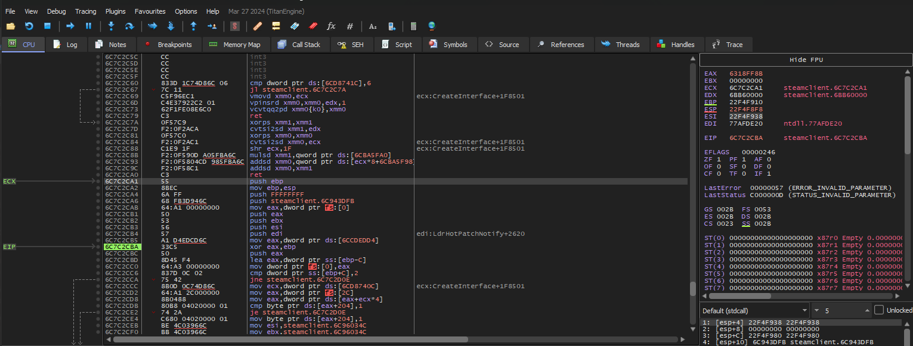
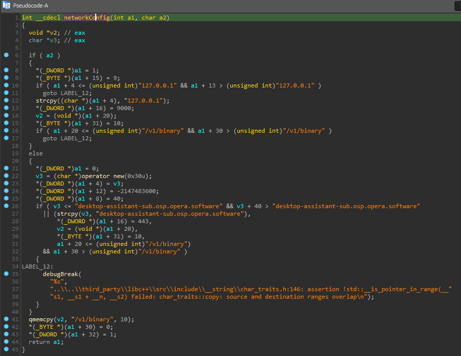
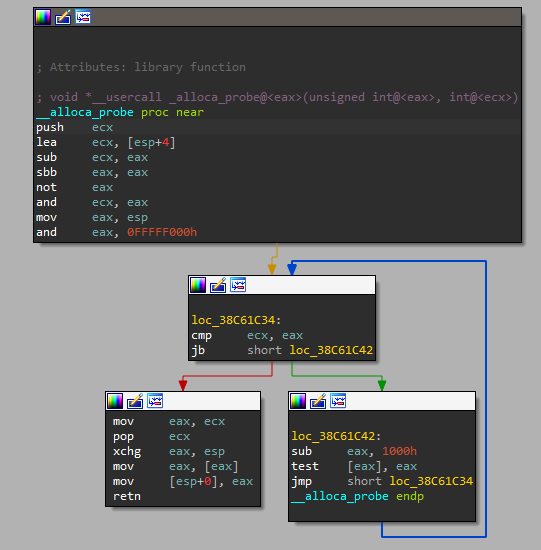
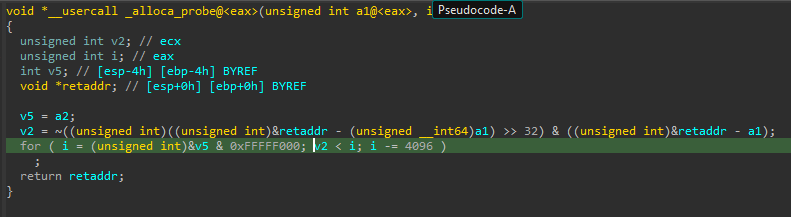

# DRM analysis and unpacking


## Overview
A brief description of the project, its context, and its significance.

Digital rights management (DRM) is the use of technology to control and manage access to copyrighted material. 
DRM is mainly used to prevent piracy, hacking, copying, and gathering analytics and data. 

In this analysis I will breakdown the mechanics of how a DRM system developed by a very popular distribution company (you could probably guess who), and examine possible methods to bypass or unpack DRM. 
## Significance 
DRM is widely disliked amongst consumers due to it having an impact on performance, including longer load times and decreased functionality, and preservation due to DRM servers being shut down (though this instance is relatively rare). 

## Objectives
- Objective 1
- Objective 2
- ...

## Terminology
- Breakpoint


## Key Technologies/Tools Used
List the main technologies or tools used in the project


## Results/Findings

# Static analysis
After loading an executable from this distribution company, it first starts by loading a sequence of instructions setting up the stack for a function call


And this is a graph view of where it takes us to

As you can see it is very large, however most of it doesn't seem to do anything, however there is an interesting portion here

This snippet utilizes Windows API functions to perform checks on the process and thread environment basically to ensure the environment is secure and not being tampered with (anti-debugging strategy). If any of the cases fail in the condition check, it jumps to label_315 where it performs additional checks, likely exiting the program. 

Here is the assembly

Here it is doing the same as the pseudocode shown previously, however you can see in the assembly here that it moves 'T' into bl and then sets bl to the memory address [edp+arg_0+3] before an unconditional jump to label 315.

Now if you don't know assembly this might look confusing. I added comments to help simplify it.

Here's a breakdown of the registers:
| Register | Description                    |
|----------|--------------------------------|
| `edx ( base register)`    | stores data temporarily during calculations or operations |
| `ebp (base pointer)`    | Reference point within a function's stack frame |
|`eax (data register)`     | Primarily used for arithmetic and logical operations for temporary storage |
| `bl (base low register)`     | Holds the lower 8 bits of `ebx`, used for byte-level ops or as part of memory addresses. 
| `cl (count low register)`    | Contains the lower 8 bits of the `ecx` register, used for loop control or byte-level ops like string manipulation.
| `esi (source index register)`    | Often used as a pointer to the source data in memory during string ops or data movement, like a starting point for accessing data. 



And here is label 315 where it checks if the lower byte of the ebx register ('bl') is equal to the ASCII character 5, and if it's not equal, it jumps to the end of the program.

 It also performs this check for the ASCII characters '0' and 'E'. Clearly bl is not set to any of those values as mentioned previously, so as it is a `jz (jump if zero)` condition, it jumps to the end of the program where IDA conveniently commented trap to debugger. 
 

As we can see, there is some anti-debugging going on in the executable to deter reverse engineering and analysis, but the DRM logic is not contained within the main executable itself. 

Surely there is some logic for unpacking the executable but without understanding how the packing process is handled, you can't be sure. I will be revisiting this section later on.

# Dynamic analysis
In x32dbg the executable eventually makes a call to `distibutor-client.dll` where some stuff finally starts happening. 



Here we can see the start of the graph view in IDA


For those new to assembly, the `test` operation here performs a bitwise AND operation between a register and itself, this is normally done to check if a register contains a null pointer(zero).

Being that the offset of `off_38EAB1C` is a non-zero value, we will continue down that left side of the graph. 

Stepping into `eax` we see this in the graph view


Immediately we can tell its probably something to do with allocating memory on the stack as __alloca is a function provided by Microsoft's C runtime library (CRT). 



Now lets look at the pseudocode to help make sense of this

Following this route eventually leads elsewhere and not to the DRM logic so 


Looking at the main DRMCaller, it first leads us 
## Conclusion
A short conclusion reflecting on the project outcomes and objectives.

## Code Snippets
(If applicable) List of code snippets used in the project.
Snippet 1.
```java
static int add(int a, int b) {
    return a + b;
}
```
Snippet 2.
```java
static int subtract(int a, int b) {
    return a - b;
}
```

## References
(If applicable) List of references or sources cited in the project.

386D19F0