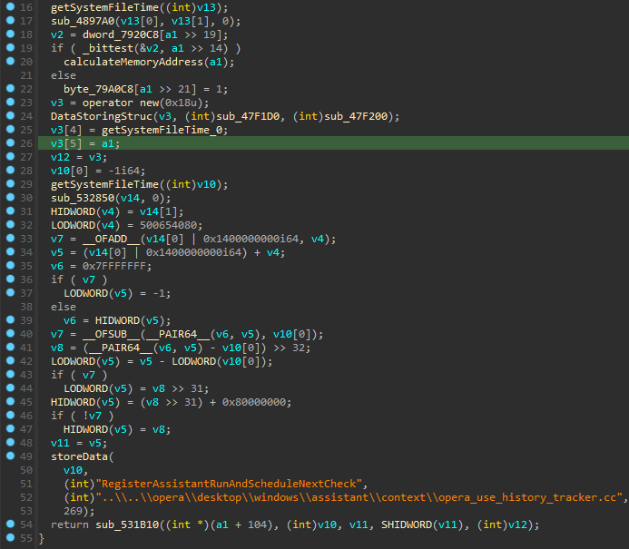
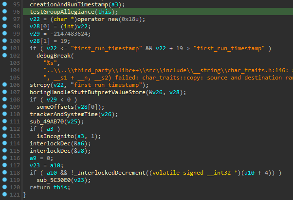
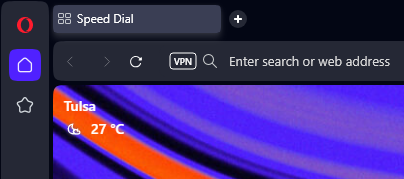
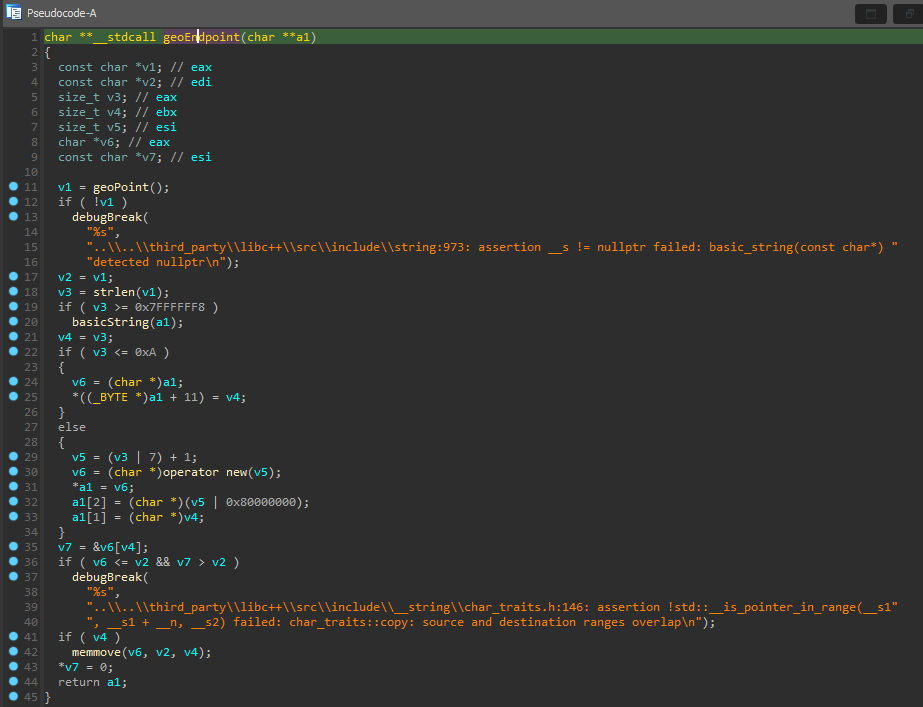
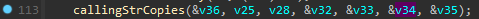
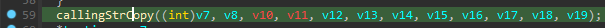
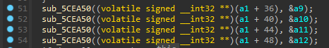
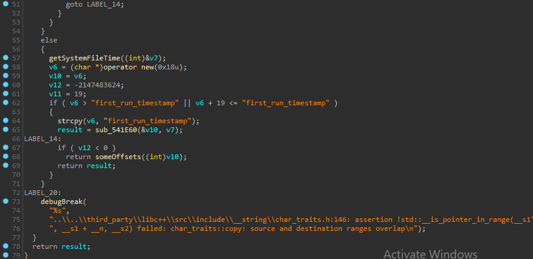
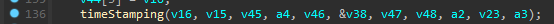
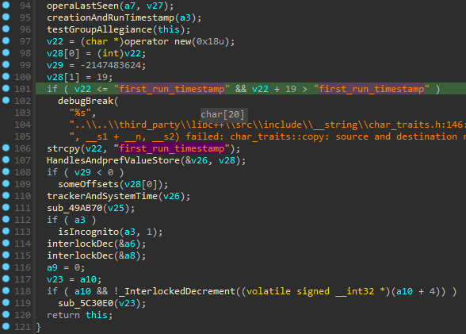

## other stuff
To make the rest easier to follow, I followed the cross references to the start of where the geo tracking subroutines are first initialized.  

but for part 1 were going to start off with explaining what avro is, the network structure function, and how the geolocation is sent back to them. 


This function which i've called serverSetupAndOtherData is packed full of different ways this application collects, manipulates, stores, and sends different types of the users data. Remember, as a browser, some of the data it collects is necessary and normal, however I found some notable information. 

As said previously, in this part 1 I will only be going over the geo location part, and in this main subroutine, it starts with a function i've named `geoProcessAndNotify`.


As you can see it's passes 5 variables so lets backtrace and see what their values are first. 


For v56 all we know is that the values at the 0th index of the array is -1 and the 1st index holds 17


We can see here v34 is set to the value `*(_DWORD *)(v20 + 4);`
Backtracing again to the value of v20


Shoot, looks like we need to know what value is held in `this` at runtime to properly reverse this.

Annoying but not a problem we just need to translate the static IDA address to its dynamic memory address in x32dbg. You can do this easily by getting the base address in x32dbg from the memory map:


Then rebasing in IDA:


And setting a breakpoint to the address of our function back in x32dbg:


And now we're set to analyze its runtime behavior effectively as we can see the values that are being pushed onto the stack before calling `geoProcessAndNotify`


v33 is set to the 32-bit value found at an offset of 100 bytes from the pointer returned by getSystemTime(). The exact value of v33 depends on the data located at this specific memory offset within the structure or array pointed to by the return value of getSystemTime().


Now the last one `v32` is called after checking if mojo is initialized, and if it is it executes `connPipeLayer1` with a couple arguments. 

We'll get into what connPipeLayer1 does in part two, for now all we need to know is that v32 holds the value of a pointer to a block of allocated memory on the heap of size `0x50u`


SO
a1 = Array holding 2 values ([-1], [17])


a2 = some value decided at runtime + 40

a3 = some value decided at runtime

a4 =  *(_DWORD *)(getSystemTime() + 100);

a4 = pointer to a block of allocated memory connecting the pipeLayer


Inside there's a few interesting functions.

notifcationsAndAllegiance

setPrefIncognito
networkHistory

bcrpyPrimitives

countries

callingGeoLayer1

isIncognito

timeStampingAndOtherCoolStuff


First it calls a function I named `DataStoringStruc` which does as the name says, setting up a structure to take in some data. 

Then calls `notificationsnStuff`

Thankfully they used a lot of strings helping us know what each function is doing. 


Looks like this allocates memory to copy:
Opera last seen time
Opera last use
Opera notifications
Last notifcation time
Run timestamping
Blacklisted notifcations
And test group intelligence, this one is interesting because giving group allegiance a quick google search we can see that it is a marketing & analytics company...


storeData and monitorNextWindowLead are called with Dst and other parameters. These functions likely perform logging or monitoring tasks.


## This contains avro service and start to networkConfig stuff
Starting with the avro service:


This is the first function invoked by `avroSetupAndOtherData` passing a value of a location in memory and the string "test-avro-srv". 


inside it compares "test-auto-srv" (Str) and data accessed through `this` and then calls a function I named `cluster`.


Now this function seems really long and intricate but its actually very quickly returned.

it first takes a few arguments, the length of the string `"test-auto-srv"` which is 13 and two other variables.

Tracing back the value of v9, this is how that value is set:


005D0CD0 - 

```
v4 = this[7]; // assigns the value located at index 7 of the array
              // pointed to by "this"
v5 = this + 7; // assigns the pointer to the memory location that is 7
               // positions after "this"
if (!v4)       // if v4 is NULL
    goto LABEL_31;
```

Shoot, looks like we need to know what value is held in v4 at runtime to properly reverse this.

Annoying but not a problem we just need to translate the static IDA address to its dynamic memory address in x32dbg. You can do this easily by getting the base address in x32dbg from the memory map:


Then rebasing in IDA:


And setting a breakpoint to the address of our function back in x32dbg:


00D8124F | 8B77 1C                    | mov esi,dword ptr ds:[edi+1C]                       |
puts this into v4
And now we're set to analyze its runtime behavior effectively.

Running it in x32dbg, we get to the if statement on line 26 and jump to label 30:

(Using screenshots from IDA so you don't have to read the assembly)


So we can see here that it returns false


Now we have the value of v45 which was passed to our networkConfig function, now lets look at what the first value being passed is. 


The value Src takes gets passed by the value of v2. So looking at v2 we see it is mentioned 4 times here, not so bad. 

Operator new called


Then a function i've named similarDataStoringFunc which just creates a structure setting it up to be sent

Then the function trackingDataUtils is called. This looks interesting but it just tracks things like your battery etc and then notifies you if its low, so if you're concerned about china having access to your battery and hardware components then sure thats worrying, but not exactly what i'm looking for. 


0000000D


0000000D
value from edi is returned (v6)
5C650128
006FF7F0 // 00ED03DC       browser_assistant.GetHandleVerifier+1CD43C
switch statement eax starts with:
0000000D

 Inside cluster it does a bunch of string, byte-level, and data processing operations in which we won't get into.

Looking at the graph view this subroutine is extremely long (likely involving schema-based data serialization and deserialization tasks) i'm not going to waste our time diving into the intricate details here. 

So we can assume here it's probably running some tests to ensure the service is running properly.

Next, a function i've named `networkStructure` is called 


Here it is called passing the address of `Src` casted as an integer, and `v45` which holds the result of the avroProcess function, stepping into `networkConfig` we see:


As we can see here a2 `(v45, the result from avroProcess)` is what determines the behavior of this function. 


calledLabel:
        v24 = *(_DWORD *)(v13 - 13);
        if ( v24 != *(_DWORD *)(v14 - 13) )
        {
          v6 = (unsigned __int8)v24 - *(v14 - 13);
          if ( v6 )
            v6 = 2 * (v6 > 0) - 1;
          if ( v6 )
            return v6;
          v6 = *(v13 - 12) - *(v14 - 12);
          if ( v6 )
            v6 = 2 * (v6 > 0) - 1;
          if ( v6 )
            return v6;
          v6 = *(v13 - 11) - *(v14 - 11);
          if ( v6 )
            v6 = 2 * (v6 > 0) - 1;
          if ( v6 )
            return v6;
          v6 = *(v13 - 10) - *(v14 - 10);
          if ( v6 )
            v6 = 2 * (v6 > 0) - 1;
          if ( v6 )
            return v6;
        }





Clearly some sort of obfuscation or something going on here as you can see in the graph overview. Does a bunch of calculations and is very important as its called with a variety of different arguments



user-agent





## About the networkStructure function, probably a good lead on where the target service endpoint is specified.

```
The function sub_4825F0 appears to be a C function that initializes a structure or buffer (a1) based on the value of a2. Let's break down what this function does:

Function Analysis
Parameters:
int a1: Appears to be a pointer or offset to a buffer or structure.
char a2: A flag that determines the initialization behavior (0 or non-zero).
Behavior:
Initialization Based on a2 Value:

If a2 is non-zero (a2 != 0):
Set *(_DWORD *)a1 = 1 (assuming a1 points to an integer at the beginning).
Set *(_BYTE *)(a1 + 15) = 9.
If the space from a1 + 4 to a1 + 13 can fit "127.0.0.1", set "127.0.0.1" at a1 + 4.
Set *(_DWORD *)(a1 + 16) = 9000.
Copy "/v1/binary" to v2 (starting at a1 + 20).
Set *(_BYTE *)(a1 + 31) = 10.
If a2 is zero (a2 == 0):
Set *(_DWORD *)a1 = 0.
Allocate 0x30 bytes (48 bytes) of memory and store the pointer at a1 + 4.
Set *(_DWORD *)(a1 + 12) = -2147483600.
Set *(_DWORD *)(a1 + 8) = 40.
If the allocated memory can fit "desktop-assistant-sub.osp.opera.software", copy it there.
Set *(_DWORD *)(a1 + 16) = 443.
Copy "/v1/binary" to v2 (starting at a1 + 20).
Set *(_BYTE *)(a1 + 31) = 10.
Common Steps for Both Cases:

Always copy "/v1/binary" to v2 (starting at a1 + 20).
Set *(_BYTE *)(a1 + 30) = 0.
Set *(_DWORD *)(a1 + 32) = 1.
Error Handling:

If the conditions for copying "127.0.0.1" or "desktop-assistant-sub.osp.opera.software" fail due to overlapping ranges, it breaks with a debug message.
Usage Context
The function seems to be setting up a buffer or structure (a1) with specific network-related parameters (host, port, endpoint) based on the value of a2. This kind of function is often found in network programming to initialize connection details or endpoint configurations dynamically.

Destination for Sending Data
From the provided function, it's clear that it sets up the destination (host, port, endpoint) where data can potentially be sent. Here’s how it does it:

If a2 is non-zero, it sets:

host to "127.0.0.1" (localhost).
port to 9000.
endpoint to "/v1/binary".
If a2 is zero, it sets:

host to "desktop-assistant-sub.osp.opera.software".
port to 443.
endpoint to "/v1/binary".
These are typical configurations for network communication, where host is the target server or service, port is the port number on that server, and endpoint is the specific API endpoint or resource path.

To summarize, the sub_4825F0 function prepares the a1 buffer with network configuration details based on a2, which likely determines the destination for sending data within the broader application context.


Based on the provided information, the endpoint is set to "/v1/binary" when a2 is zero. Here’s a breakdown of what the endpoint typically represents and how you might use it:

Endpoint Structure
Host: "desktop-assistant-sub.osp.opera.software"
Port: 443
Endpoint Path: "/v1/binary"
Full URL
Combining the host, port, and endpoint path, the full URL would look something like this:

bash
Copy code
https://desktop-assistant-sub.osp.opera.software:443/v1/binary
Using the Endpoint
HTTP Request: You would use this URL to make an HTTP request, typically a POST request to send data to the server. Here’s a generic example of how you might structure this request in C using libcurl:
c
Copy code
#include <curl/curl.h>
#include <stdio.h>
#include <stdlib.h>
#include <string.h>

// Function to send data to the endpoint
void send_data_to_endpoint(const char *data) {
    CURL *curl;
    CURLcode res;
    struct curl_slist *headers = NULL;

    // Initialize curl
    curl_global_init(CURL_GLOBAL_ALL);
    curl = curl_easy_init();
    
    if(curl) {
        // Set URL
        char url[256];
        snprintf(url, sizeof(url), "https://desktop-assistant-sub.osp.opera.software:443/v1/binary");

        // Set HTTP POST request
        curl_easy_setopt(curl, CURLOPT_URL, url);
        curl_easy_setopt(curl, CURLOPT_POSTFIELDS, data);

        // Set headers
        headers = curl_slist_append(headers, "Content-Type: application/octet-stream");
        curl_easy_setopt(curl, CURLOPT_HTTPHEADER, headers);

        // Perform the request
        res = curl_easy_perform(curl);
        if(res != CURLE_OK)
            fprintf(stderr, "curl_easy_perform() failed: %s\n", curl_easy_strerror(res));

        // Cleanup
        curl_easy_cleanup(curl);
        curl_slist_free_all(headers);
    }

    curl_global_cleanup();
}

int main() {
    const char *data = "Your binary data here";
    send_data_to_endpoint(data);
    return 0;
}
Points to Consider
Protocol: The URL uses HTTPS (https://) because the port is 443, which is the default port for HTTPS traffic.
Data Format: The data sent to the endpoint is typically in binary format (application/octet-stream), but you should adjust the Content-Type header based on the actual data format required by the server.
Error Handling: Proper error handling and logging are essential for production code to handle network failures, timeouts, and other issues gracefully.
Summary
Endpoint URL: https://desktop-assistant-sub.osp.opera.software:443/v1/binary
HTTP Method: Usually POST for sending data.
Headers: Set the appropriate Content-Type and other headers as needed.
Make sure to replace "Your binary data here" with the actual data you intend to send. Adjust the Content-Type header according to the data format specified by the server's API documentation.


so i couldnt just visit that link in my browser
ChatGPT
Correct, you typically cannot directly visit or access an endpoint like https://desktop-assistant-sub.osp.opera.software:443/v1/binary in a web browser like you would with a regular website URL. Here's why:

Understanding Endpoints
API Endpoint vs. Webpage:

The endpoint "/v1/binary" you mentioned is designed for API communication, not for serving web pages. APIs are meant for programmatic interaction between applications or systems, often exchanging data rather than displaying content in a browser.
HTTPS and Port 443:

The URL uses HTTPS (https://) and specifies port 443, which is the default port for secure HTTP connections. Browsers expect web servers to respond with HTML content over HTTPS on port 443, typically for web pages.
Content-Type and Response:

API endpoints often expect specific data formats (application/json, application/octet-stream, etc.) and respond with structured data or perform actions based on the request. Browsers expect HTML content and may not handle other content types or responses gracefully.
What Happens if You Try to Visit Such URL in a Browser?
If you try to visit https://desktop-assistant-sub.osp.opera.software:443/v1/binary directly in a web browser:

Possible Outcomes:

Timeout or Error: The browser may show a timeout error or fail to load the page because the server does not respond with HTML content expected by the browser.
Download Prompt: If the server responds with a downloadable file (application/octet-stream), the browser might prompt you to download the file rather than displaying it.
Security Warning: Browsers may show a security warning if the HTTPS certificate is not valid or if there are other security concerns with the connection.

Proper Usage of API Endpoints
To interact with API endpoints like "/v1/binary":

Use API Clients or Tools: Use tools like curl, Postman, or programmatic HTTP libraries in your preferred programming language to send requests to the API endpoint and handle the responses appropriately.
Expect JSON or Binary Data: Prepare your code to handle JSON responses or binary data based on the API documentation provided by the service.
Conclusion
API endpoints are designed for programmatic use, allowing applications to communicate and exchange data in a structured manner. They are not designed for human browsing in web browsers due to the differences in expected content types and responses. To interact with such endpoints effectively, use appropriate tools and libraries that facilitate API communication and data exchange.
```


Sadly need to reverse "needToReverseThis" to fully understand whats going on within network func


# Opera Data Collection analysis


browser is based on the google open-source software project "chromium" developed by google. 
3 Main functions that call the statistics collection check
Lets call them `callStats1`, `callStats2`, and `callStats3`

Lets start with `callStats1`


This block does some setup and other junk until it eventually calls a function i've named callsCheckStats with two arguments, v1, and v3[0]


Then it calls this other function i've named `stringCheckIfCanSendStats`


And here is where some interesting stuff starts happening.

So it does some setup then sets v6[4] equal to a function named enablesStatisticCollection. Hmm... I wonder what that does...


In fileOperations it uses this:
https://chromium.googlesource.com/chromium/src/+/HEAD/base/files/file_util_win.cc

This seems to be handling some file utility functions for windows OS, seems to do some file manipulation, i/op ops, system queries, and other ops for windows. Typically these files would include funcitonality to interact with windows API for file management. 

Looks like it does some setup to receive the statistic collection, obviously file system operations are required to receive statistics. 
Here it does some setup and null pointer handling before enabling statistic collection as it has printed here. 


Looking at the cross references to `aReaddata` we can see four references, all within the same subroutine. 
We can see here Multiple calls to the same function with two same paramters each time, `ReadData` and `"..\\..\\opera\\desktop\\windows\\assistant\\tracking_data\\tracking_data_provider_impl.cc"`
Now at first I thought this was another built in chromium, however with a quick google search, it appears chromium does NOT have any built in "google tracking"... Interesting. So they implemented this on their own.


the function sub_5CE0A0 is designed to store data into an array pointed to by a1. If a1 points to a valid memory location and the values of a2, a3, and a4 are meaningful and properly initialized, then the function will indeed store your data in memory.




This seems to be a function designed to store data into an array pointed to by a1. `a1` points to a valid memory location and the values `a2`, `a3`, and `a4` are meaningful and properly initialized. however `retaddr` variable not being properly initialized or used, so this part of tfhe funciton needs  to be handled correctly to avoid any iunintended behavior or memory corruption. 


As we look at the cross references here, this function is used 200 times so it's very important. Looking at 




This is a function to setup the server for sending statistics, at a first glance we can see it has put a lot of stuff on the stack, maybe more than they should have.

Thankfully the developers left in some log strings to help us see what they're doing. 



First it starts by calling this function with "test-avro-srv" as an argument.

Avro servers utilize a feature called Apache Avro which is typically used to serialize and deserialize data for efficient storage, transmission, and RPC communication. 

https://www.ibm.com/topics/avro#:~:text=Avro%20is%20an%20open%20source,programs%20written%20in%20any%20language.

While Apache Avro is very secure in data transmission and Opera appropriately protects your data. It's your personal data. And while it seems very secure, nothing is 100% secure. 

Now lets look at what data they collect. 
Stepping into the function called at line 72 shown previously, we can see that 



Now in the utmSetup it leads us to a function i've named utmContent


As you can see here it's using Urchin Tracking Modules (UTM)

So UTM is a set of parameters appended to URLs in order to track the effectiveness of marketing and campaigns, by including UTM parameters in URLs, you can track which channels are driving traffic to a site and monitor the effectiveness, commonly used by analytic tools like Google Analytics. 


So it collects data on what sites you visit for marketing analytics


Here it checks if the avroServer is running and then it sends some statistics, however this instance of stat logging isn't very invasive, mostly just allowing notifications for the user. 

 
 

Now looking at trackingDataUtils


Here it makes multiple calls to this function passing `...\tracking_data_utils.cc` as an argument. The contents of the function seems to do some error handling and logging as its also mentioned another 500 times in the cross references.




There are a few key functions here being called.

Looking at partnerFile first.


Here it initializes a data structure passing \partner_content_file_selector.cc as an argument in another structure that again, is used 500 times, however this is a different structure, still unsure of what it does and why they store it in here. 



Now looking at callToTrackAgent


Inside here you can see a couple strings


Moving to WinMain


We can see that the avroServer function is being called in `informer-mode` Unsure what exactly this means

But we can assume it's some sort of data transmission mode as we will see later on
