# Opera Data Collection Analysis Part One: Broswer_assistant

In this series I will be doing an analysis of the Opera browser. You may have heard of opera as it has been promoted by some of the most popular creators on youtube and other streaming platforms. There has been some buzz around it of people saying that the Opera GX platform was "spyware" by tracking your location, and stealing users' data. In this analysis I will first be searching through the modules the Opera browser uses and seeing exactly if/how they get a users location, and uncovering other invasive tasks they perform. I will be initially focusing on if they get a users exact location and then later uncovering what data they collect.

## Motivation

The reason I decided to start this journey of reversing the Opera browser was due to stumbling upon this browser multiple times, being packaged with other software. I found this extremely annoying that I have came upon this more than once and thought it was extremely sketchy. After looking into it I saw people accusing it of being "spyware" and decided that I would investigate it myself and see. 

In this series I will go over the modules:
- opera.exe
- opera_browser.dll
- opera_elf.dll
- browser_assistant.exe

In this initial entry, I will be going over browser_assistant.exe

## Getting Geo Location

As previously said, I heard some buzz that this application tracks your exact location. So with that being said I thought a good first step would be to run wireshark and open the browser to see if it makes any sketchy requests to speed up the reversing process.

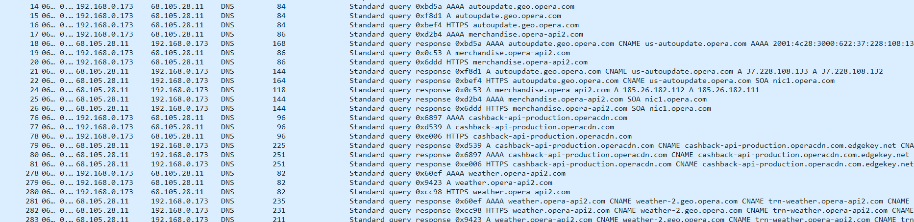

This is what we see just from opening the browser

We see some suspicous requests like autoupdate.geo.opera.com, us-autoupdate.opera.com, weather-2.geo.opera.com, and others.

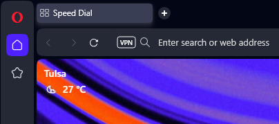

Clearly by looking at our browser it is getting my location somehow, but is the browser_assistant module the culprit?

First thing I normally do after opening a program in IDA is go to imports and exports, then I decided to search for strings related to geolocation since that is what I was seeing users raving about. Off the bat we see a few, 
in the imports tab we will see this:

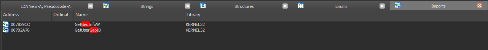

And for the strings:

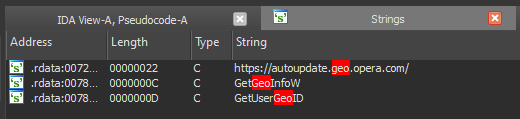

Lets follow `GetGeoInfoW` first.

As we can see here `getGeoInfoW` is a Windows API function to get location information.

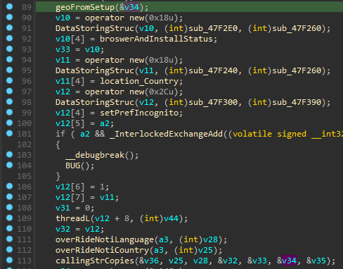

GetUserGeoID is used here and passed with 0x10u (unsigned 16 in hexadecimal)

Looking at the parameters for GetUserGeoID in windows documentation we can see that it is wanting the geographical nation.

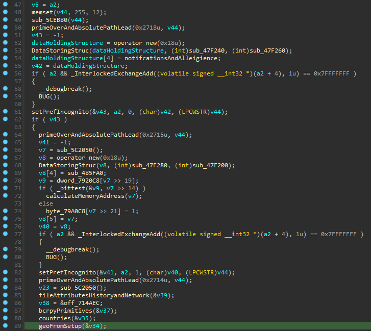

Now looking back at UserGeoID, so we can find our UserGeoID value in C:

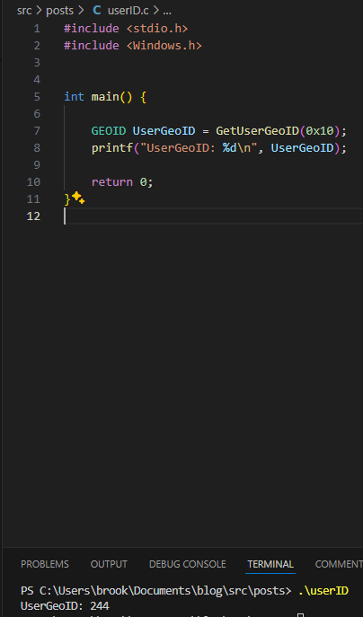

As you can see we get the value 244, and looking at the documentation for UserGeoID and going to the table of Geographical locations:

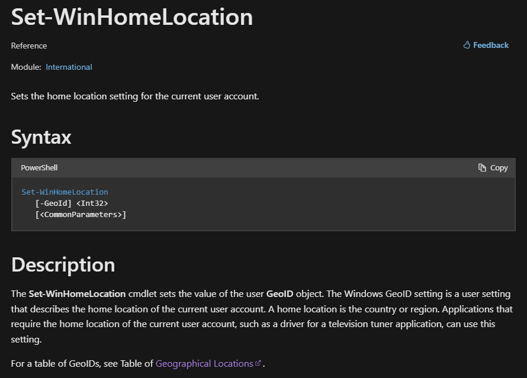

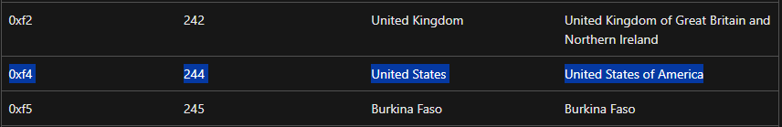

We can see that it will be able to find the users current country, however that's a very large scope of people so not that invasive. Let's see if it uses that information to narrow the search down.
In the if statement, it cheks if the geo information is == 3 (checking if the retrieved ISO 2-letter country code is returned), and if it does another conditional check for if the returned iso 2-letter country code is valid (not returning XX in ASCII)

It then checks if the geographic data corresponds to YU (Yugoslavia, though this country no longer exists) or CS (Serbia and Montenegro, which also no longer exists).
If either of these conditions is met, it sets the geographic data to RS, which corresponds to Serbia (ISO 3166-1 alpha-2 code for Serbia is RS).

It then proceeds to check for various other nations and does some handling for them 

Following the cross references, this is the main function where the geolocation checking starts taking place named `geoProcessAndNotify`

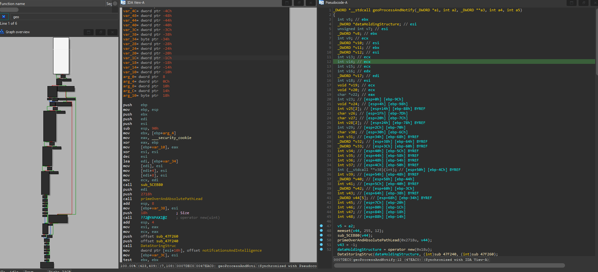

There are some other functions inside `geoProcessAndNotify` that do interersting things like checking what times you open up the browser, if you're in incognito mode, what language to have for your preferences, country overrides, however none of the content seems to be too abnormal for a browser. 

I had some difficulties wanting to investigate too many functions because they looked interesting, but we have to remember that this is a browser and a lot of what it's checking is completely necessary. With that being said, a lot of the code being used we do not care about at all.

So inside this main `geoProcessAndNotify` function from the last photo, we see a function inside of it I named `geoFromSetup` on line 89

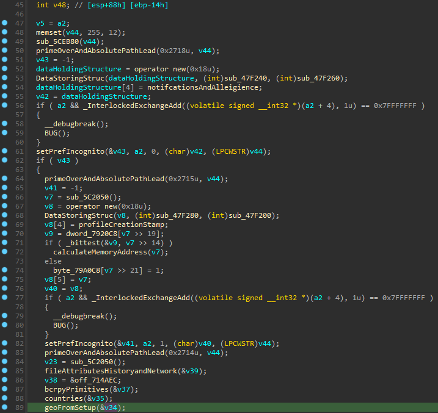

Stepping inside `geoFromSetup` we see:

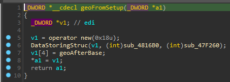

Here it just sets up a basic array structure getting ready to hold some data then calls `geoAfterbase`

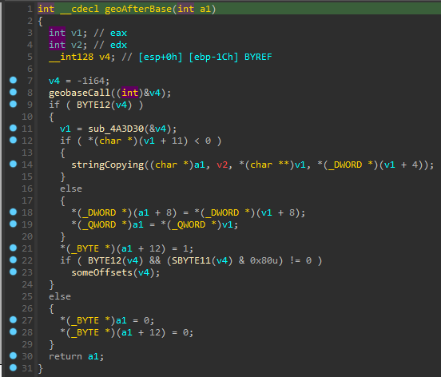

Here `geoAfterBase` initializes v4 to -1 and then passes its address to `geobaseCall`

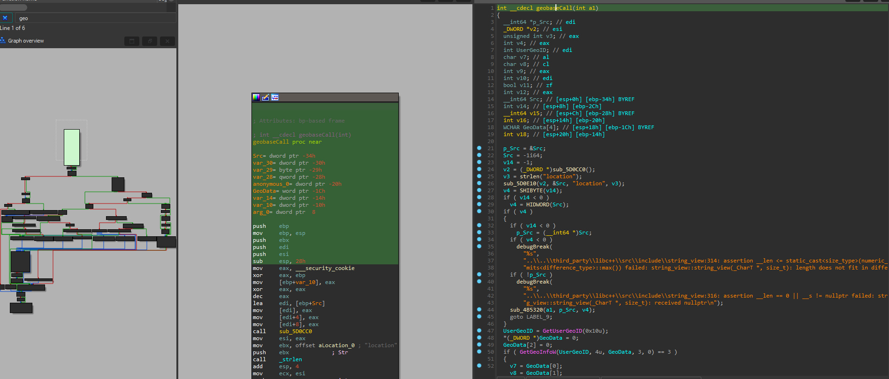

And then here we are back at the first reference from .rdata

So we can see by backtracking the cross references it does for sure have our location, and it's storing it in a structure to hold it.

So after it returns from the function that retrieves our geo region, it then takes the value and copies it to a string in the subroutine `callingStrCopies` which returns the value along with other data to `&v36`.

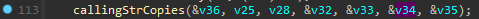

Some strings are copied at locations in memory after `a1` then returns `a1` which serves as a buffer.

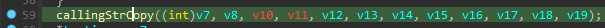

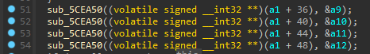

`v36` is then moved into `v14`, and `v45` then called in a function i've named timeStamping passing the value of the data `v45` as an argument:

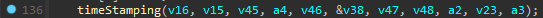

Stepping inside this is what we see:

There are two functions that we will be looking at in here:

- `operaLastSeen`
- `creationAndRunTimeStamp`

First inside `operaLastSeen`

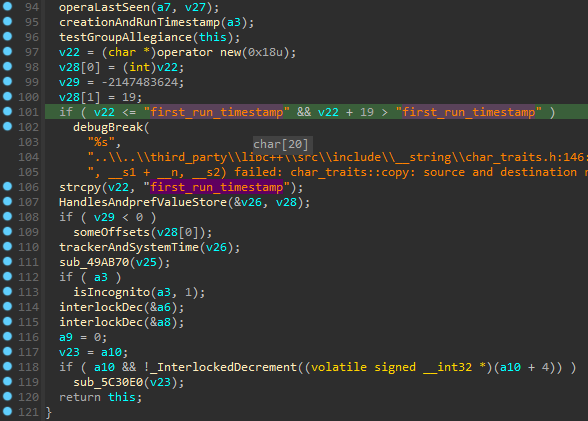

Here we can see some interesting functions and some strings telling us what is going on. We see that it is timestamping every first run of the browser. Stepping inside the `operaLastseen` function at the top:

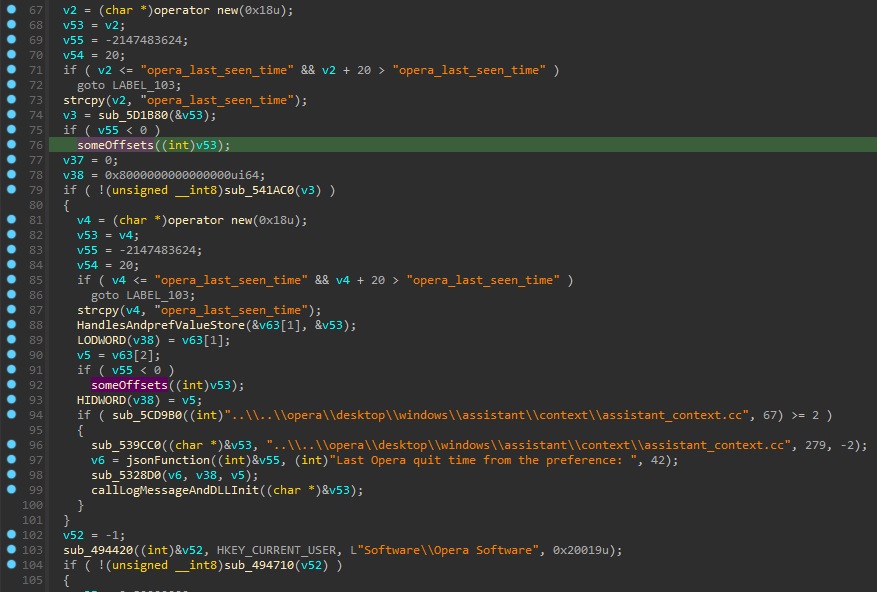

We can see here that it includes some more strings telling us that it also tracks the last run of the browser.

Then into `creationAndRunTimestamp` which takes a parameter that assigns `v34` to `a3` that gets passed.
 
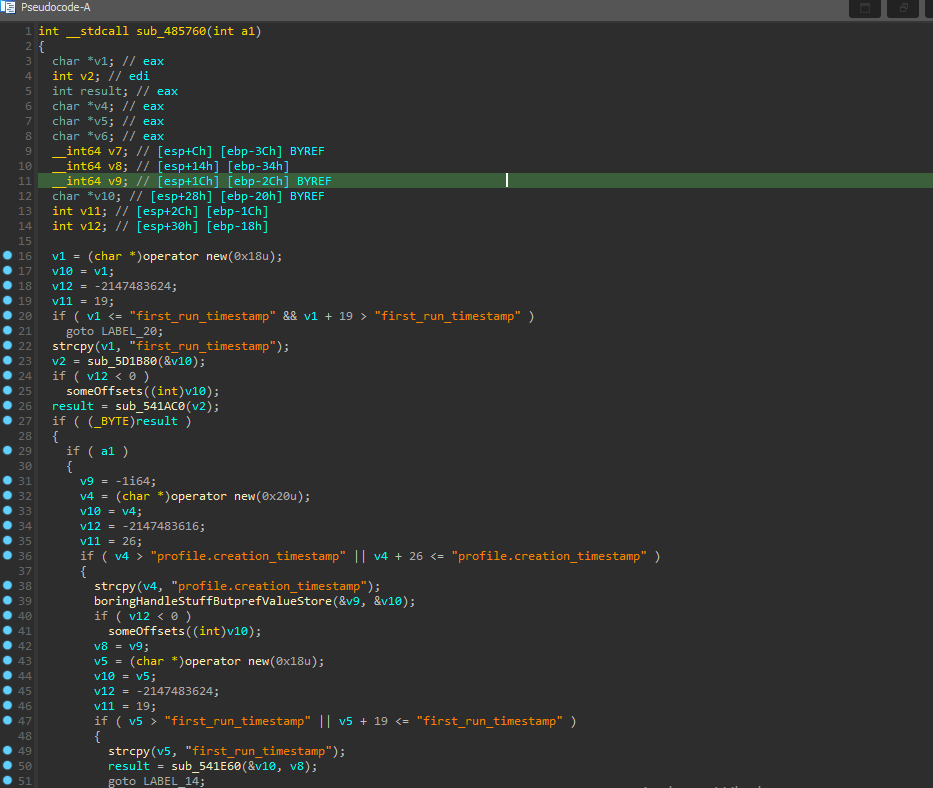

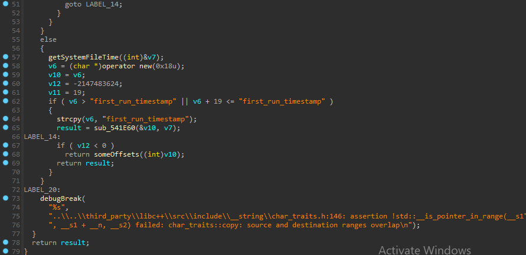

And thankfully there's some strings to help us see that this function is used for timestamp management and some profile creation operations.

So it gets our country using the windows api, our time using GetSystemTimeAsFileTime, and our last use which stamps our runtime, but never sends it across any network for them to keep. So it does have our aproximate location down to our timezone, but so far in this module, does not get our exact location. 

# getaddrinfo

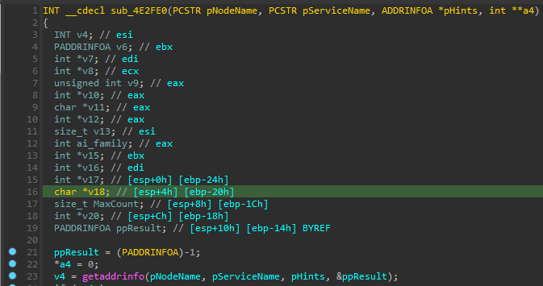

Another method they possibly could have used was getting a users ip using the `getaddrinfo` Windows API and then querying an IP location service, but it was clear they needed to use it for resolving domain names and other common browser functions. Also we saw from running the program in Wireshark that it made no requests to an IP service to get our location. This means that either 
- Opera has made an update to no longer get the users exact location via IP services and uses a new method

- The broswer_assistant module is not involved with getting users location

We know for a fact that it DOES get the users location seen from the screenshots at the start, so Opera not getting the users location isn't a possiblity.

Now as shown previously in wireshark, it makes a request to a domain that seemed rather suspicous and we can find it in the browser_assistant module.

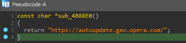

However by looking at the cross references, this function clearly does nothing. I suspect this is likely used from another module in the program folder, so we will be revisiting this in the future.

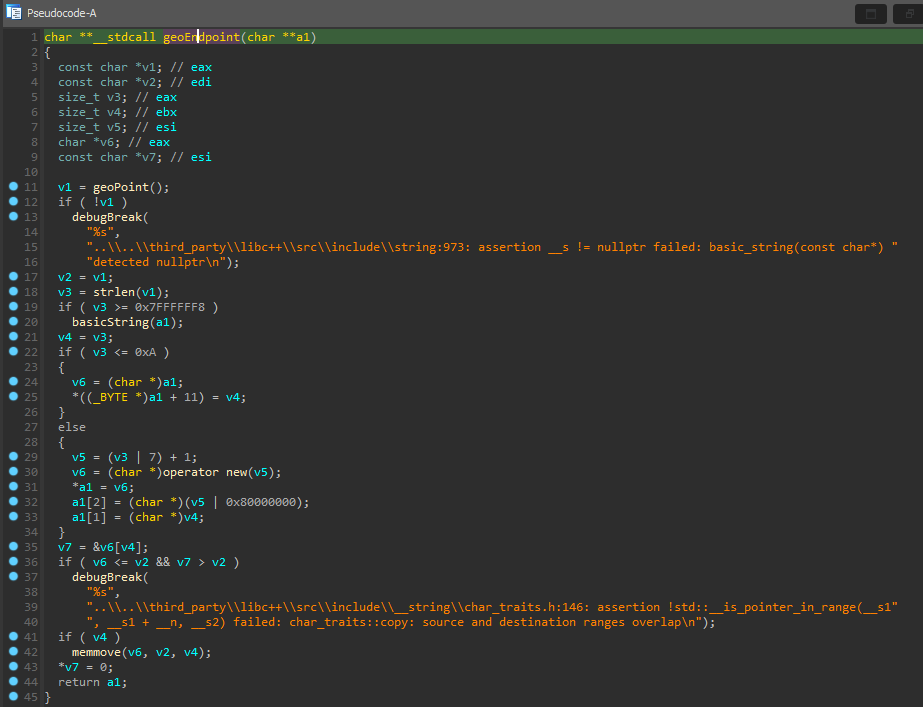

In conclusion, it seeems clear that the `browser_assistant` module does not operate as spyware according to our goal of finding where our coordinates our being tracked. Instead it performs normal IP address retrieving, and identifiying gerneral geo locations on the coiuntry level, and gathering statistics related to browser usage or connectivity. There is some statistic collection of what sites you visit, however I consider that rather normal in my opinion since the data collected is anonymized in this instance. 

The functions we reviewed are common functionalities in network libraries and tools used by applications for ensuring network connection and basic network-related info. 

While the `browser_assistant` module may perform some data gathering and statistical operations, its level of invasiveness appears minimal and does not seem to involve tracking users exact coordinates or engaging in spyware-like behavior. However analysis of additional functionalities in other modules might reveal more information or potential concerns, should that be the case we will be revisiting this.
