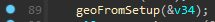
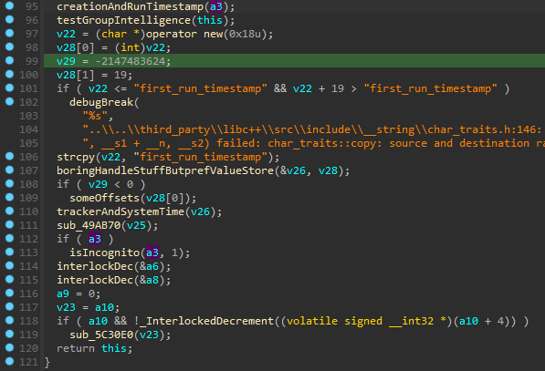

# Opera Data Collection Analysis Part One: Broswer_assistant

In this series I will be doing an analysis of the Opera browser. You may have heard of opera as it has been promoted by some of the most popular creators on youtube and other streaming platforms. There has been some buzz around it of people saying that the Opera GX platform was "spyware" by tracking your location, and stealing users' data. In this analysis I will first be searching through the modules the Opera browser uses and seeing exactly if/how they get a users location, and uncovering other invasive tasks they perform. I will be initially focusing on if they get a users exact location and then later uncovering what data they collect.

## Motivation

The reason I decided to start this journey of reversing the Opera browser was due to stumbling upon this browser multiple times, being packaged with other software. I found this extremely annoying that I have came upon this more than once and thought it was extremely sketchy. After looking into it I saw people accusing it of being "spyware" and decided that I would investigate it myself and see. 

## Getting Geo Location

As previously said, I heard some buzz that it has been said that this application tracks your exact location. So with that being said I thought a good first step would be to run wireshark and open the browser to see if it makes any sketchy requests to speed up the reversing process.

This use of windowsAPI brought some suspision, a Chinese owned company getting your location?

As seen here getGeoInfo is a winAPI function to get location information.

GetUserGeoID is used here and passed with 0x10u (unsigned 16 in hexadecimal)

Looking at the parameters for GetUserGeoID in windows documentation we can see that it is wanting the geographical nation.

Now looking back at UserGeoID, we can easily find out UserGeoID value in C:

As you can see we get the value 244, and looking at the documentation for UserGeoID and going to the table of Geographical locations:

We can see that it will be able to find the users current country, however that's a very large scope of people so not that invasive. Let's see if it uses that information to narrow the search down.
In the if statement, it cheks if the geo information is == 3 (checking if the retrieved ISO 2-letter country code is returned), and if it is it does another if statement checking if the returned iso 2-letter country code is

The code is initially checking if the geographic data does not correspond to XX.
It then checks if the geographic data corresponds to YU (Yugoslavia, though this country no longer exists) or CS (Serbia and Montenegro, which also no longer exists).
If either of these conditions is met, it sets the geographic data to RS, which corresponds to Serbia (ISO 3166-1 alpha-2 code for Serbia is RS).

It then proceeds to check for various other nations and does some handling for them 

Following the cross references, this is the main function where the geolocation checking starts taking place

There are some other functions that do interersting things like checking what times you open up the browser, if you're in incognito mode, what language to have for your preferences, country overrides, however none of the content seems to be too abnormal for a browser.

So from here it calls a function I called geoFromSetup

Stepping into `geoFromSetup` it just sets up a basic array structure getting ready to hold some data then calls `geoAfterbase`

 initializes v4 to -1 and then passes its address to geobaseCall

And then here we are back at the first reference from .rdata

Back the last cross reference where the geolocation information is called:

It returns the value it was passed with, and v34 is only used one other time,

Some strings are copied at locations in memory after `a1` then returns `a1` which serves as a buffer.

`v36` is then moved into `v14`, and `v45` then called in a function i've named timeStamping:

Stepping inside this is what we see:

Stepping inside the operaLastSeen function there are some strings telling us that it tracks the last use time.

Then into `creationAndRunTimestamp` which takes a parameter that assigns 34 to a3 that gets passed.
 

And thankfully there's some strings to help us see that this function is used for timestamp management and some profile creation operations.

So it gets our country using the windows api, our time using GetSystemTimeAsFileTime, and our last use which stamps our runtime, but never sends it across any network for them to keep. So it does have our aproximate location down to our timezone, but does not get our exact location.

# getaddrinfo

Another method they possibly could have used was getting a users ip using the `getaddrinfo` windows API and then querying an IP location service, but it was clear they needed to use it for resolving domain names and other comon browser functions.

Now as shown previously in wireshark, it makes a request to a domain that seemed rather suspicous and we can find it in the browser_assistant module.

In conclusion, it seeems clear that the `browser_assistant` module does not operate as spyware according to our goal of finding where our coordinates our being tracked. Instead it performs normal IP address retrieving, and identifiying gerneral geo locations on the coiuntry level, and gathering statistics related to browser usage or connectivity.

The functions we reviewed are common functionalities in network libraries and tools used by applications for ensuring network connection and basic network-related info. 

While the `browser_assistant` module may perform some data gathering and statistical operations, its level of invasiveness appears minimal and does not seem to involve tracking users exact coordinates or engaging in spyware-like behavior. However analysis of additional functionalities in other modules might reveal more information or potential concerns, should that be the case we will be revisiting this.
