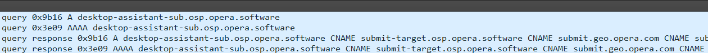

# Opera Data Collection Technical Analysis Part 1: Broswer_assistant

In this series I will be doing an analysis of the Opera browser. You may have heard of opera as it has been promoted by some of the most popular creators on youtube and other streaming platforms. There has been some buzz around it of people saying that the Opera GX platform was "spyware" by tracking your location, and stealing users' data. In this analysis I will first be searching through the modules the Opera browser uses and seeing exactly if/how they get a user's location, and uncovering other invasive tasks they perform. I will be initially focusing on if they get a user's exact location and then later uncovering what data they collect.

## Motivation

The reason I decided to start this journey of reversing the Opera browser was due to this program being bundled with other software and ended up on my device without my consent. I found this was both annoying and a bit sketchy, driving me to look into it further. After a bit of research, I saw people accusing it of being "spyware" and decided that I would investigate it myself and see.

In this series I will go over the modules:

- opera.exe

- opera_browser.dll

- opera_elf.dll

- browser_assistant.exe

In this initial entry, I will be going over browser_assistant.exe

The browser_assistant module is defaulted to run at startup and does not run persistently. 

## Introduction

Before blindly searching for strings in IDA, it's a good idea to understand how an application can get a users location. 

However if you don't care and just want to see the results you can move onto the next section (Getting Geo Location).

There's multiple ways an engineer could get a users location. For this module it will be a bit harder to narrow down which methods they would be most likely to use because unlike the main browser exe, it's not ran in a sandboxed environment, so no restrictions for direct access to Windows API's

For runtime behavior, it starts 2 processes of itself, hooks opera.exe, then quits the 3 instances.

I won't be going into detail on how the code for each Windows Location API works, but what I did was get an overview of keywords and strategies they were using to help make my search more efficient.

Some possible methods we can look at for getting this user data for this module could be:

- Windows Location API
- Querying external Geolocation API's

Starting with Windows Location API. Using this method, the developer has potential to:
- Use a geofence: Receive notifications when the user's device has entered or left an area of interest.
- Handle changes in location permissions: Register for the Geolocator's StatusChanged event and use the StatusChangedEventArgs to determine the current position status.
- Get location from a background task
- Handle geofencing events from a background task
- Handle geovisit events from a background task
- Obtain satellite data: When available, use the GeocoordinateSatelliteData class to obtain additional information on the quality of the satellite based location data.
- Display a toast: Notify the user when a geofencing event has occurred in the background.
- Refresh geofence binding: Refresh the binding on resume and after removal of a geofence. Note that removal requires subscribing to removal events if a geofence is set as single use or a duration is set.
- Request access to the user's location: Request access to the user's location using the - RequestAccessAsync method. Important: call the RequestAccessAsync before accessing the user's location. At that time, your app must be in the foreground and RequestAccessAsync must be called from the UI thread. Until the user grants your app permission to their location, your app can't access location data.
- Track when the user visits a location: Poll for or receive notifications when the user spends significant time in a location.
- Help the user change location settings: Link to location privacy settings from your app if the user revokes access to location while your app is in the foreground. Call the - LaunchUriAsync method with the URI "ms-settings://privacy/location"

Link to Windows Location API samples:
https://github.com/Microsoft/Windows-universal-samples/tree/main/Samples/Geolocation

### Using Wifi and IP Geolocation Services

  
Show C code example of getting user longitude/latitude

  <pre><code class="language-c">

#include <stdio.h>
#include <stdlib.h>
#include <string.h>
#include <winsock2.h>
#include <windows.h>
#include <wininet.h>

#pragma comment(lib, "ws2_32.lib")
#pragma comment(lib, "wininet.lib")

void getGeolocation() {
    HINTERNET hInternet = InternetOpen("GeolocationApp", INTERNET_OPEN_TYPE_DIRECT, NULL, NULL, 0);
    if (hInternet == NULL) {
        printf("Failed to open internet connection.\n");
        return;
    }

    HINTERNET hConnect = InternetOpenUrl(hInternet, "https://www.geoplugin.net/json.gp", NULL, 0, INTERNET_FLAG_RELOAD, 0);
    if (hConnect == NULL) {
        printf("Failed to connect to geolocation service.\n");
        InternetCloseHandle(hInternet);
        return;
    }

    char buffer[1024];
    DWORD bytesRead;
    BOOL bResult = InternetReadFile(hConnect, buffer, sizeof(buffer) - 1, &bytesRead);
    if (bResult && bytesRead > 0) {
        buffer[bytesRead] = '\0';
        printf("Response: %s\n", buffer);

        char *latitude = strstr(buffer, "\"geoplugin_latitude\":");
        char *longitude = strstr(buffer, "\"geoplugin_longitude\":");
        char *city = strstr(buffer, "\"geoplugin_city\":");
        char *region = strstr(buffer, "\"geoplugin_region\":");
        char *country = strstr(buffer, "\"geoplugin_countryName\":");
        char *timezone = strstr(buffer, "\"geoplugin_timezone\":");
        
        if (latitude && longitude && city && region && country && timezone) {
            latitude += 21;
            longitude += 22;
            city += 18;    
            region += 20;   
            country += 24;   
            timezone += 22;  

            char lat[20], lon[20], ct[100], rg[100], cntry[100], tz[100];
            strcpy(lat, strtok(latitude, ","));
            strcpy(lon, strtok(longitude, ","));
            strcpy(ct, strtok(city, ","));
            strcpy(rg, strtok(region, ","));
            strcpy(cntry, strtok(country, ","));
            strcpy(tz, strtok(timezone, ","));

            FILE *file = fopen("geolocation.txt", "w");
            if (file != NULL) {
                fprintf(file, "Latitude: %s\n", lat);
                fprintf(file, "Longitude: %s\n", lon);
                fprintf(file, "City: %s\n", ct);
                fprintf(file, "Region: %s\n", rg);
                fprintf(file, "Country: %s\n", cntry);
                fprintf(file, "Timezone: %s\n", tz);
                fclose(file);
                printf("Geolocation data written to geolocation.txt\n");
            } else {
                printf("Failed to open file for writing.\n");
            }
        }
    } else {
        printf("Failed to read response from geolocation service.\n");
    }

    InternetCloseHandle(hConnect);
    InternetCloseHandle(hInternet);
}

int main() {
    WSADATA wsaData;
    if (WSAStartup(MAKEWORD(2, 2), &wsaData) != 0) {
        printf("Failed to initialize Winsock.\n");
        return 1;
    }

    getGeolocation();

    WSACleanup();
    return 0;
}

This Is probably the most simple way to execute this, using an external API to retrieve the users geolocation based on their IP or WIFI info. Though the accuracy varies, it can be precise when the IP is at a fixed address like for a corporate network or home broadband, but not so accurate for dynamic IP's

## Getting Geo Location

As previously said, I heard some buzz that this application tracks your exact location. So with that being said I thought a good first step would be to run wireshark and open the main browser module to see if it makes any sketchy requests to speed up the reversing process.

When we run the app, it quesries a DNS server `desktop-assistant-sub.osp.opera.software`  for both IPv4 and IPv6 addresses. The DNS server responds with the corresponding IP addresses and includes additional information about how the domain resolves through CNAME records. These records also mention submit.geo.opera.com, so we can assume that part of the domain's functionality involves interactions or redirections to a geo-related service.

First thing I normally do after opening a program in IDA is go to imports, exports, and strings. After the research done earlier relating to Windows Location API, and external geolocation services, I searched for keywords that would lead to areas of interest.

For Exports:

And for the strings:

Let's follow `GetGeoInfoW` first.

As we can see here `getGeoInfoW` is a Windows API function to get location information.

GetUserGeoID is used here and passed with 0x10u (unsigned 16 in hex)

Looking at the parameters for GetUserGeoID in windows documentation we can see that it is wanting the geographical nation.

Now looking back at UserGeoID, so we can find our UserGeoID value in C:

As you can see we get the value 244, and looking at the documentation for UserGeoID and going to the table of Geographical locations:

We can see that it will be able to find the user's current country, however that's a very large scope of people so not that invasive. Let's see if it uses that information to narrow the search down.
In the if statement, it checks if the geo information is == 3 (checking if the retrieved ISO 2-letter country code is returned), and if it does another conditional check for if the returned iso 2-letter country code is valid (not returning XX in ASCII)

It then checks if the geographic data corresponds to YU (Yugoslavia, though this country no longer exists) or CS (Serbia and Montenegro, which also no longer exists).
If either of these conditions is met, it sets the geographic data to RS, which corresponds to Serbia (ISO 3166-1 alpha-2 code for Serbia is RS).

It then proceeds to check for various other nations and does some handling for them

Following the cross references, this is the main function where the geolocation checking starts taking place named `geoProcessAndNotify`

There are some other functions inside `geoProcessAndNotify` that do interesting things like checking what times you open up the browser, if you're in incognito mode, what language to have for your preferences, country overrides, however none of the content seems to be too abnormal for a browser.

I had some difficulties wanting to investigate too many functions because they looked interesting, but we have to remember that this is a browser and a lot of what it's checking is completely necessary. With that being said, a lot of the code being used we do not care about at all.

So inside this main `geoProcessAndNotify` function from the last photo, we see a function inside of it I named `geoFromSetup` on line 89

Stepping inside `geoFromSetup` we see:

Here it just sets up a basic array structure getting ready to hold some data then calls `geoAfterbase`

Here `geoAfterBase` initializes v4 to -1 and then passes its address to `geobaseCall`

And then here we are back at the first reference from .rdata

So we can see by backtracking the cross references it does for sure have our location, and it's storing it in a structure to hold it.

So after it returns from the function that retrieves our geo region, it then takes the value and copies it to a string in the subroutine `callingStrCopies` which returns the value along with other data to `&v36`.

Some strings are copied at locations in memory after `a1` then returns `a1` which serves as a buffer.

`v36` is then moved into `v14`, and `v45` then called in a function i've named timeStamping passing the value of the data `v45` as an argument, so now our geo data is in `v45` when this is called:

Stepping inside this is what we see:

There are two functions that we will be looking at in here:

- operaLastSeen

- creationAndRunTimeStamp

First inside `operaLastSeen`

Here we can see some interesting functions and some strings telling us what is going on. We see that it is timestamping every first run of the browser. Stepping inside the `operaLastseen` function at the top:

We can see here that it includes some more strings telling us that it also tracks the last run of the browser.

Then into `creationAndRunTimestamp` which takes a parameter that assigns `v34` to `a3` that gets passed.

And thankfully there's some strings to help us see that this function is used for timestamp management and some profile creation operations.

So it gets our country using the windows api, our time using GetSystemTimeAsFileTime, and our last use which stamps our runtime, but never sends it across any network for them to keep. So it does have our approximate location down to our timezone, but so far in this module, does not get our exact location.

## Getting IP address

Another method they possibly could have used was getting a users ip using the `getaddrinfo` Windows API and then querying an IP location service, but it was clear they needed to use it for resolving domain names and other common browser functions.

Also we saw from running the program in Wireshark that it made no requests to an IP service to get our location. This is interesting because that was the strategy of the OperaGX browser, this means either:
- The broswer_assistant module is not involved with getting users location

- Opera has made an update to no longer get the users exact location via IP services and uses a new method

We know for a fact that it DOES get the users location seen from the screenshots at the start, so Opera not getting the users location isn't a possibility.

## /autoupdate.geo.opera
Now as shown previously in wireshark, it makes a request to a domain that seems rather suspicious and we can find it in the browser_assistant module.

However by looking at the cross references, this function clearly does nothing. I suspect this is likely used from another module in the program folder, so we will be revisiting this in the future.

# Conclusion
In conclusion, it seems clear that the `browser_assistant` module does not operate as spyware according to our goal of finding where our coordinates are being tracked. Instead it performs normal IP address retrieving, and identifying general geo locations on the country level, and gathering statistics related to browser usage or connectivity. There is some statistical collection of what sites you visit, however I consider that rather normal in my opinion since the data collected is anonymized in this instance.

The functions we reviewed are common functionalities in network libraries and tools used by applications for ensuring network connection and basic network-related info.

While the `browser_assistant` module may perform some data gathering and statistical operations, its level of invasiveness appears minimal and does not seem to involve tracking users exact coordinates or engaging in spyware-like behavior. However analysis of additional functionalities in other modules might reveal more information or potential concerns, should that be the case we will be revisiting this.

The reason I decided to start this journey of reversing the Opera browser was due to this program being bundled with other software and ended up on my device without my consent. I found this was both annoying and a bit sketchy, driving me to look into it further. After a bit of research, I saw people accusing it of being "spyware" and decided that I would investigate it myself and see.