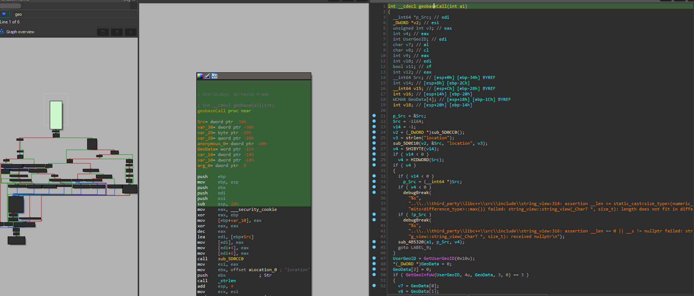

# Writing an exe packer

Understand the PE File Format:

Study the structure of the PE file format. This is crucial as you'll need to read and modify the EXE files.
Key parts include the DOS header, PE header, section headers, and the actual sections (code, data, resources).
Read the Input EXE:

Open the input EXE file and read its contents into memory.
Parse the headers to understand the structure of the file and locate the sections.
Compress the Sections:

Use a compression library (such as zlib) to compress the sections of the EXE.
Store the compressed data and note the original sizes.
Create a Stub Loader:

The stub is a small piece of code that decompresses the sections and transfers control to the original entry point of the EXE.
This stub should be written in C or assembly and should handle memory allocation and decompression.
Construct the Packed EXE:

Create a new PE file in memory or on disk.
Copy the headers from the original EXE and modify them as necessary.
Add a new section for the stub loader.
Append the compressed sections and update the section headers.
Write the Packed EXE to Disk:

Write the modified headers and new sections to a new EXE file.


# Technical overview of how the packer works

To organize this easier i'm going to go down the main method and explain how each function being called works. 


Starting with read_exe_file

Called with two arguments, `argv[1]` - an array of strings `char*` that holds the command line argument passed to the program, and `&size` - the address of the variable `size` allowing the function to store the size of the file. 

Declared as a pointer variable named `exe_data` of type `BYTE*`, `exe_data` will represent our buffer. Don't have much experience using the data type `BYTE`, but looks like its commonly used to represent a pointer to an array of bytes or a buffer, great for workign with binary data, reading from files, or transferring data. 

So obviously going to remove the print statements, change the function names, and use an obfucator when I have a production ready software, but i'm including them for this demonstration to make it easier to see whats going on. I'm okay with explaining how this works because probably nobody will ever see this and it's going to help me backtrack myself if I confuse myself in development, or on the off chance that someone reads this if they're wanting to learn the concepts behind writing a packer. 


Basic function for reading a file into memory. If you know the basics of how a file is read into memory then you can skip to the next one. As said previously, it takes two parameters, a pointer to a string containing the name of the file passed in the CLI argument, and a pointer to a `DWORD` variable where the size of the file is stored. 

The reason a `DWORD` is used here rather than some other data type is for consistency with other Windows API functions and structs. Also `DWORD` explicitly communicates that the size is supposed to be a non negative integer value. So an `int` could be used, but `DWORD` is a convention with the Windows API. 

Then `filename` is opened in `read binary` mode, then returns a file pointer `FILE*` that points to the opened file. Then the if statement checks if the pointer is null to see if it wasn't able to open the file. 

Next fseek, *size, and a second fseek is used to move the pointer to EOF, get file position using ftell, and move the pointer back to the beginning. Then memory is allocated, and the file is read into the memory buffer `buffer`, reads `*size` each of size 1 bytre, from the file pointed to by `file`, then the content is stored in the memory buffer. 




Now the function for pasing the pe header is called with one argument, the buffer holding the the data of the exe. Then the parsed DOS header is returned as a pointer to the parsed DOS header struct `PIMAGE_DOS_HEADER`, where it will contain info about the DOS header of the exe. 


# implementing threads in app

```

In a program designed to pack executables (or other files) using threads, here’s a typical layout where threads would be beneficial:

Layout for Using Threads in a Packing Program:
Initialization and Input Handling:

Initialize the packing program.
Accept input parameters such as directories to pack, compression options, and output file paths.
File Discovery:

Traverse through the specified directories to gather files that need to be packed.
Optionally, filter files based on criteria like file extension or size.
Thread Pool Creation:

Create a pool of worker threads. The number of threads in the pool can be determined dynamically based on the system's hardware capabilities (number of CPU cores).
Task Distribution:

Divide the list of files to be packed among the threads. Each thread will handle a subset of files.
Ensure threads do not duplicate work and efficiently utilize available CPU resources.
Thread Function (Packing Routine):

Each thread executes a packing routine for its assigned files. This routine typically includes:
Opening each file.
Compressing or packing the file using the specified compression algorithm (e.g., ZIP, GZIP).
Writing the packed file to the output archive or executable.
Handling errors and exceptions within the thread to maintain stability.
Thread Synchronization:

Use synchronization mechanisms like mutexes or semaphores to coordinate access to shared resources such as the output archive or status information.
Ensure threads do not concurrently access or modify critical sections of code to prevent data corruption or race conditions.
Progress Reporting:

Update and report packing progress to the user interface or logging mechanism. Each thread may contribute to progress updates based on its completed tasks.
Completion and Cleanup:

Once all threads have completed their tasks (packing all assigned files), synchronize their completion.
Consolidate or finalize the output archive or executable if necessary.
Clean up any temporary resources or threads to release system resources properly.
Example Thread Utilization:
Main Thread: Responsible for program initialization, user interaction (input/output), and managing overall program flow.

Worker Threads: Execute the packing routine concurrently for different subsets of files.

Each worker thread independently packs its assigned files, improving overall program efficiency.
Benefits:
Parallelism: Utilize multiple CPU cores to speed up the packing process.
Efficiency: Handle large volumes of files more effectively without blocking the main program thread.
Responsiveness: Keep the user interface (if any) responsive by offloading intensive tasks to worker threads.
Considerations:
Thread Safety: Ensure that shared resources are accessed safely to prevent conflicts and data corruption.
Error Handling: Implement robust error handling to manage exceptions and ensure program stability.
Testing: Thoroughly test the multi-threaded packing program under various conditions to validate performance gains and reliability.
By structuring the packing program with threads as outlined above, you can optimize performance and improve the user experience when packing executables or other files.
```